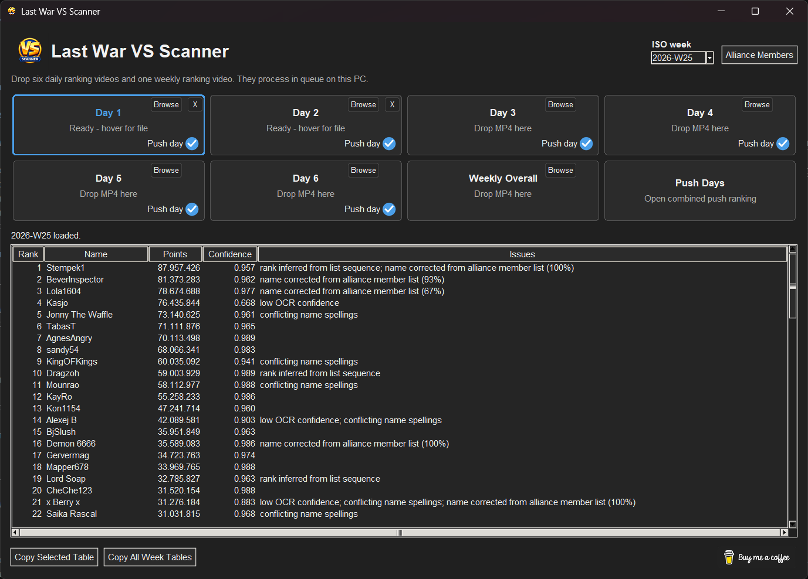

# Last War VS Scanner

Local Windows tool for extracting alliance-member names, VS points, and visible ranks from a phone `.mp4` screen recording. Frames, OCR output, corrections, and exports remain on the PC.



## Privacy and scope

- All local. OCR runs locally with RapidOCR/ONNX Runtime and PaddleOCR CPU models.
- The tool only reads a supplied video. No credentials or game control.

## Windows setup

### Recommended: release download

[**Download Last War VS Scanner for Windows (ZIP)**](https://github.com/dmitriyborodko/last-war-vs-scanner/releases/latest/download/Last-War-VS-Scanner-windows-x64.zip)

Download `Last-War-VS-Scanner-windows-x64.zip` from the [latest GitHub Release](https://github.com/dmitriyborodko/last-war-vs-scanner/releases/latest),
extract the whole ZIP, and run `Last-War-VS-Scanner.exe`. Python is not required,
and the OCR models are included for offline use. Windows SmartScreen may show a
warning until releases are code-signed; use **More info** only if the download is
from this repository's Releases page.

### Run from source

Install 64-bit Python 3.11 or 3.12, then copy the iPhone recording to the PC using a USB cable or another local transfer method. From PowerShell:

```powershell
cd path\to\vsParser
.\run.ps1
```

Alternatively, double-click `run.cmd` in File Explorer or run it from Command Prompt:

```bat
cd /d path\to\vsParser
run.cmd
```

The first run creates `.venv` and installs dependencies. Download the multilingual model bundle once while online:

```powershell
.\run.ps1 -DownloadModels
```

The models are stored under `models/paddleocr`. Later video processing is completely local and does not require internet access. Set `VS_PARSER_MODEL_DIR` before launching to use a pre-provisioned model directory on another drive or an offline deployment.

## Use

1. Better to start with **Alliance Members** and paste a column of your teammates to fill the member table. It will help you to recognise names from your video better.
2. Choose the ISO week in the top-right corner. The current week opens automatically; the selector also includes the previous two years and every saved week.
3. Record a video on your phone where you scroll vs points for some day from top to bottom. Shorter videos process faster and there is no need to scroll too slow, 10 seconds should be enough for it :)
4. Drag each `.mp4` onto its **Day 1** through **Day 6** or **Weekly Overall** box. Clicking the box opens its result tab.
5. Select **Push days** to check who really deserves a train.

Weekly history is stored locally under `data/weeks`; processed files are grouped under `output/weeks`. Opening a saved week restores its reviewed tables without rerunning video processing.

Raw automatic outputs are also saved as `observations.json`, `results.json`, `vs_rankings.csv`, and `vs_rankings.xlsx` in the output folder. Selected source frames are kept under `frames`.

The optional local roster defaults to `data/member_roster.json`. It retains corrected Unicode names and the OCR spellings seen for them. This helps symbols and stylized names resolve consistently in later recordings; uncertain matches remain review flags.
The detector runs once per frame. Name boxes are then recognized by a cached PP-OCRv6 recognizer for Latin (including Vietnamese) and Chinese, plus current PP-OCRv5 language-family recognizers for Cyrillic and Arabic. Confidence, Unicode script compatibility, and roster similarity select the candidate. Numeric rank and point fields stay on the fast default recognizer. Arabic remains logical Unicode in JSON/CSV/XLSX; the desktop and spreadsheet software handle visual right-to-left display.

After observations are merged, recognized names are corrected against the roster again. Unmatched OCR names are assigned to the most similar alliance member when there is a meaningful resemblance. Only names with no sufficiently similar member are highlighted red; saved members still absent after this correction are added at the bottom with zero points and highlighted yellow.

Models are loaded lazily and cached for the lifetime of the desktop process, including all seven queued videos. If the multilingual bundle is absent, the prior RapidOCR Chinese/basic-Latin path remains available and the model downloader can be run later.
